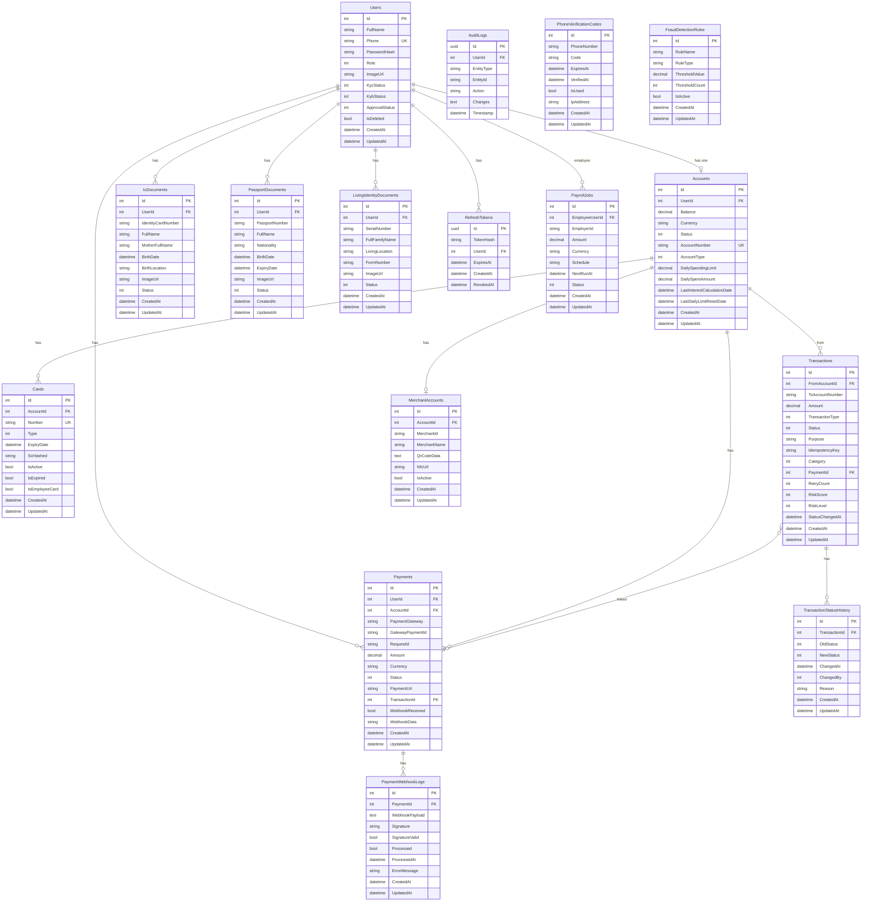

# SuperMemo Database Schema

## ER Diagram (Mermaid)

View this file in GitHub, VS Code (with Mermaid extension), or [Mermaid Live Editor](https://mermaid.live).

## How to view the diagram

1. **dbdiagram.io**  
   - Open [https://dbdiagram.io](https://dbdiagram.io).  
   - Copy the contents of `database-schema.dbml` and paste into the editor to see the schema and export as image/PDF.

2. **Mermaid (this file)**  
   - Open this `.md` file in GitHub, or in VS Code with a Mermaid extension, or paste the `mermaid` block into [Mermaid Live Editor](https://mermaid.live).

3. **Tables summary**  
   - **Users** – app users (Admin/Customer), KYC/approval state.  
   - **Accounts** – one per user, balance, currency, status, account number.  
   - **Cards** – cards linked to an account.  
   - **Transactions** – transfers, top-ups, interest; links to FromAccount and optional Payment.  
   - **Payments** – gateway payments (e.g. QiCard); link to User, Account, and optional Transaction.  
   - **PaymentWebhookLogs** – webhook payloads and processing status.  
   - **RefreshTokens** – JWT refresh tokens per user.  
   - **AuditLogs** – audit trail (entity, action, changes).  
   - **IcDocuments, PassportDocuments, LivingIdentityDocuments** – KYC documents per user.  
   - **PayrollJobs** – payroll runs (employee user, amount, schedule).  
   - **PhoneVerificationCodes** – OTP codes for phone verification.  
   - **MerchantAccounts** – merchant/QR per account.  
   - **FraudDetectionRules** – configurable fraud rules.  
   - **TransactionStatusHistory** – status change history for transactions.
